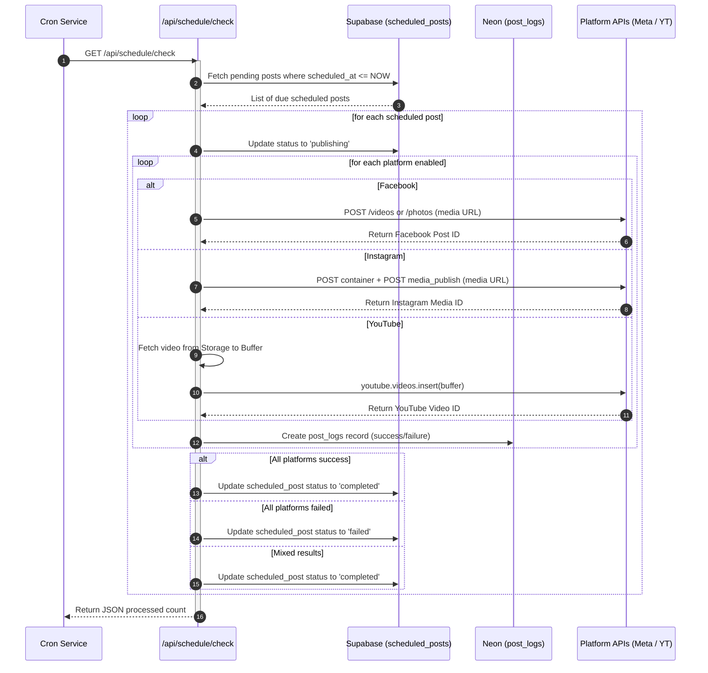

# UNIPOST AI - COMPLETE PROJECT KNOWLEDGE DUMP
*(Technical & Business Architecture Reference)*

---

## SECTION 1: PRODUCT OVERVIEW

### What is the Product?
**UniPost AI** is a modern, enterprise-grade, AI-powered social media management and SaaS platform. It acts as a unified command center for content creators, agencies, and businesses to draft, optimize, schedule, publish, and track performance of social media content across multiple platforms simultaneously.

### What Problem Does it Solve?
Social media managers and creators face severe inefficiencies when managing multiple accounts. They have to:
1. Manually resize, upload, and tailor captions for each platform (Facebook, Instagram, YouTube, etc.).
2. Work across different analytics interfaces to gather performance data.
3. Waste time coordinating visual assets and written copy across separate schedulers.

UniPost AI solves this by providing a single dashboard where users can upload an asset once, utilize multimodal AI to extract visual insights and generate customized captions for each platform, publish immediately or schedule for later, and view unified, aggregated analytics.

### Target Users
- **Independent Content Creators**: Vloggers, influencers, and digital artists.
- **Social Media Managers (SMMs)**: Professionals managing portfolios for multiple brands.
- **Digital Agencies**: Teams coordinating campaign execution and reporting.
- **SMEs & Brand Owners**: Businesses seeking to grow their digital footprint with minimal manual overhead.

### Core Value Proposition
- **Adobe-Level UI/UX**: Premium styling featuring dark themes, glassmorphism, and neon accents.
- **Multimodal AI Intelligence**: Automatic extraction of objects, emotions, and context from images/videos to auto-generate platform-specific posts.
- **Unified Cross-Platform Analytics**: Real-time cross-platform metrics merging Facebook, Instagram, and YouTube.
- **Robust Scheduling engine**: Automatic conversion of local timezone inputs (e.g. IST) to UTC for scheduled publishing via lightweight crons.

### Current Development Stage
The project is in its **Beta/Pre-Production stage**.
- Core components (Next.js 14 App Router, Tailwind, ShadCN UI) are fully established.
- Database schemas are fully migrated to a dual-database model (Supabase for auth/connections and Neon PostgreSQL for primary data).
- Real social platform APIs (Meta Graph API v19.0/v25.0, Google YouTube API v3) are fully integrated.
- Local development testing modes are operational, with credentials and APIs verified.

### Beta Readiness
The platform is **Beta Ready**. 
- Development bypass modes (such as disabled authentication blocks in cron endpoints and local testing configurations) are in place.
- Health check endpoints (`/api/analytics/test`) are implemented to verify database and API dependencies.
- Next.js production building is fully operational with 0 TypeScript/compilation errors.

### Major Features
1. **Glassmorphic Neon Dashboard**: Sleek visual interface for checking active platforms, publishing history, and recent posts.
2. **AI Multimodal Media Analyzer**: Video frame-extraction and image analysis using Llama 4/3.2 multimodal models via Groq.
3. **AI Caption & Title Generator**: Localized captioning utilizing Groq's Llama 3.3 model.
4. **Immediate & Scheduled Publishing**: Multi-platform parallel publisher with automatic error capturing.
5. **Timezone-Agnostic Scheduler**: Scheduled post engine writing to Supabase, running via light crons.
6. **Dual Database Pipeline**: Neon Postgres (primary) + Supabase (auth/auth tokens/storage).

---

## SECTION 2: USER FLOW

The complete user journey represents an end-to-end publishing, automation, and analytics loop:

```
    Signup / Auth
          ↓
  Connect Accounts (Meta / Google OAuth)
          ↓
  Create Post / Upload Media
          ↓
  Generate AI Content (Analysis & Captioning)
          ↓
  Choose Action: Publish Now OR Schedule
          ↓
  [Publish Now] → Parallel API Dispatch → Success/Failure Logged
  [Schedule]    → Saved to Supabase → Cron Polls → Executed at Date
          ↓
  Fetch Analytics (Cron / Manual Ingestion)
          ↓
  Save Snapshots (Retention Cleanup)
          ↓
  Dashboard Updated (Live totals & platform stats)
```

### Detailed Flow Steps:

1. **Signup & Authentication**:
   - The user registers or logs in via Supabase Auth (Client/Server-side cookies).
   - Once authenticated, the user is redirected to the `/dashboard` area.

2. **Connect Accounts**:
   - The user visits the settings panel and chooses to connect accounts (Facebook, Instagram, YouTube).
   - **Meta (Facebook/Instagram)**: User is redirected to Meta OAuth Dialog (`pages_show_list`, `pages_manage_posts`, `instagram_basic`, `instagram_content_publish`, `business_management`). Callback exchanges code for a long-lived user token, fetches Facebook pages, extracts linked Instagram Business IDs, and saves page access tokens securely in `connected_accounts`.
   - **Google (YouTube)**: User goes through Google OAuth. Callback saves the refresh token and access token in `connected_accounts`.

3. **Create Post & Upload Media**:
   - User goes to the "Create Post" screen.
   - User uploads an image or video asset and specifies target platforms.

4. **Generate AI Content**:
   - User requests AI assistance. 
   - If media is uploaded, the **AI Media Intelligence** engine runs: it extracts key frames for videos or analyzes images, sends them to Groq, and generates tailored texts (captions, tags, hashtags, CTA, Catchy Titles) in a structured JSON payload.
   - If text-only, the **AI Caption Generator** uses text ideas to create platforms-optimized copy.

5. **Publish / Schedule Decision**:
   - **Publish Now**: User clicks "Publish". The frontend uploads files as multipart form-data. The server handles parallel API requests to Meta and Google, saves the external IDs, logs the publishing outcome, triggers an immediate analytics fetch, and updates the UI.
   - **Schedule**: User inputs a future publication date/time in local time (e.g. IST). The server converts this to UTC, uploads the files to Supabase Storage, and inserts a `scheduled_posts` record marked as `pending`.

6. **Scheduler Cron Ingestion**:
   - Every minute, a cron service pings `/api/schedule/check`.
   - The handler selects `pending` records where `scheduled_at` <= current time, updates their status to `publishing`, downloads the assets from storage, dispatches them to platform APIs, logs results/errors to `post_logs`, and marks the schedule record as `completed` or `failed`.

7. **Analytics Sync**:
   - Periodic cron or manual invocation triggers `/api/fetch-analytics`.
   - The server gathers all active user connections, fetches live metrics for successful posts from platform APIs, updates the `post_logs` table, and logs a new `analytics_snapshots` record.
   - The system cleans up old snapshots, keeping only the latest 5.

8. **Dashboard Render**:
   - The user views their dashboard. The frontend polls `/api/dashboard/stats` and `/api/analytics/advanced`.
   - Live metrics are calculated on the fly by aggregating records from the `post_logs` and `analytics_snapshots` tables.

---

## SECTION 3: SYSTEM ARCHITECTURE

### High-Level Architecture Diagram

```
                 ┌────────────────────────────────────────────────┐
                 │                   FRONTEND                     │
                 │   Next.js 14 App Router (Tailwind + ShadCN)    │
                 └───────────────────────┬────────────────────────┘
                                         │ Requests
                                         ▼
                 ┌────────────────────────────────────────────────┐
                 │                   API LAYER                    │
                 │ Next.js App Route Handlers (/api/publish, etc) │
                 └───────┬──────────────────────────────┬─────────┘
                         │                              │
                         ▼ Auth (Cookies/JWT)           ▼ Database / Services
  ┌──────────────────────────────────────────────┐  ┌────────────────────────────────────┐
  │                 SUPABASE                     │  │          SERVICES LAYER            │
  │  - Auth Service (User & Sessions)            │  │  - aiService (Groq API wrapper)    │
  │  - OAuth Integrations (Meta & Google)        │  │  - connectionService (Supabase DB) │
  │  - Storage Buckets (instagram_media)         │  │  - instagramService (Graph API)    │
  │  - DB Tables (connected_accounts,            │  │  - youtubeService (Google APIs)    │
  │               scheduled_posts)               │  │  - analyticsService (Aggregation)   │
  └──────────────────────────────────────────────┘  └──────────────────┬─────────────────┘
                                                                       │
                                                                       ▼ Prisma Client
                                                    ┌────────────────────────────────────┐
                                                    │                NEON                │
                                                    │         Primary PostgreSQL         │
                                                    │  (posts, post_logs, snapshots)     │
                                                    └────────────────────────────────────┘
```

### Next.js Structure
The project uses the **Next.js 14 App Router** architecture:
- `app/`: Next.js 14 folder structure.
  - `app/dashboard/`: UI for dashboard panels (analytics, settings, post creation).
  - `app/login/` & `app/signup/`: User onboarding screens.
  - `app/api/`: REST endpoints managing business functions.
- `components/`: UI components.
  - `components/dashboard/`: Header, sidebar, and stats UI components.
  - `components/ui/`: Reusable primitive design system components (ShadCN UI).
- `lib/`: Centralized business utilities.
  - `lib/auth/`: Server-side session validation.
  - `lib/services/`: Social media publishing and analytics engines.
  - `lib/supabase/`: Client and Server Supabase SDK initializers.
  - `lib/prisma.ts`: Prisma Client Singleton pattern protecting DB connection pools.

### Key API Routes
- `/api/publish`: Main endpoint that takes files + metadata and posts to Facebook, Instagram, and YouTube. Creates a `posts` record and logs outcomes in `post_logs`.
- `/api/schedule`: Handles scheduling posts. Converts IST to UTC, uploads media to Supabase storage, and inserts a `scheduled_posts` record.
- `/api/schedule/check`: Cron endpoint triggering the scheduled post execution.
- `/api/fetch-analytics`: Cron endpoint retrieving live metrics from platforms and saving snapshots.
- `/api/analytics/advanced`: Fetches user snapshots and post logs to return detailed statistics.
- `/api/dashboard/stats`: Returns live aggregated numbers for the dashboard cards.
- `/api/ai/analyze-media`: Multimodal visual media analyzer using Groq API.
- `/api/ai/caption`: AI Caption Generator using Groq.

### Service Layer
- **`connectionService`**: Manages reading, writing, and soft-deleting data in the Supabase `connected_accounts` table.
- **`instagramService`**: Handles media container creation, status polling (crucial for Reels), publishing, and analytics extraction via Meta Graph API.
- **`youtubeService`**: Builds OAuth2 clients, refreshes Google tokens, uploads videos/thumbnails, and lists/deletes/fetches analytics for channels.
- **`aiService`**: Handles generation of captions and titles via Groq with local fallback protection.
- **`analyticsService`**: Coordinates platform-specific metric calls, formats data, and merges numbers across channels.

### Middleware
- `middleware.ts` acts as a request pass-through and is kept simple.
- Route security is handled at the route level via the `requireAuth` helper.

### Authentication Flow
1. User provides credentials on the frontend.
2. Supabase Auth signs in the user and sets session cookies (`sb-access-token`, `sb-refresh-token`).
3. Subsequent requests carry these cookies to the server.
4. API routes invoke `requireAuth(request)` which initializes a Supabase server client using `@supabase/ssr`, extracts the cookies, performs `supabase.auth.getUser()`, and returns the validated user context or throws an error.

---

## SECTION 4: DATABASE ARCHITECTURE

The application implements a split database architecture.

### Database Tables Map

| Table Name | Owner DB | Purpose | Key Relationships | Read Routes | Write Routes |
| :--- | :--- | :--- | :--- | :--- | :--- |
| **`auth.users`** | Supabase | Managed user login records. | Primary key referenced by all tables. | `/api/user` | Auth UI signup |
| **`connected_accounts`** | Supabase | Connected social platforms and tokens. | `user_id` -> `auth.users(id)` | `/api/dashboard/stats`, `/api/fetch-analytics`, `/api/publish` | `/api/connect/{platform}/callback` |
| **`posts`** | Neon | Master record of created/published posts. | `user_id` -> `auth.users(id)` | `/api/posts`, `/api/fetch-analytics` | `/api/publish`, `/api/posts` |
| **`post_logs`** | Neon | Platform-level publishing records and live post metrics. | `user_id` -> `auth.users(id)` | `/api/dashboard/stats`, `/api/analytics/advanced` | `/api/publish`, `/api/schedule/check`, `/api/fetch-analytics` |
| **`scheduled_posts`** | Supabase | Queued posts waiting for cron execution. | `user_id` -> `auth.users(id)` | `/api/schedule` | `/api/schedule` |
| **`analytics_snapshots`** | Neon | Historical metric snapshots. | `user_id` -> `auth.users(id)` | `/api/dashboard/stats`, `/api/analytics/advanced` | `/api/fetch-analytics` |
| **`post_analytics`** | Supabase | Post metrics (Supabase legacy backup). | `post_id` -> `posts(id)` | `/api/analytics` | `analyticsService.savePostAnalytics` |
| **`platform_accounts`** | Supabase | Platform credentials (legacy). | `user_id` -> `auth.users(id)` | N/A (Legacy) | N/A (Legacy) |

---

## SECTION 5: SUPABASE RESPONSIBILITIES

### Why Supabase Exists
Supabase functions as the **Identity, Authorization, Temporary Storage, and OAuth connection** management layer. By utilizing Supabase Auth and Storage, the application avoids hosting custom auth routers or file servers.

### List of Responsibilities & Data Formats

1. **Authentication**:
   - Manages signup, signin, password resets, and session tokens.
   - Data stored: Managed inside the private `auth` schema (e.g., `auth.users` table, storing email, passwords, login metadata, UUID).

2. **OAuth System**:
   - Handles the complex handshake flows for connecting social channels.
   - Redirects to platform auth prompts and receives authorization codes.

3. **Connected Accounts**:
   - Table: `connected_accounts`
   - Purpose: Stores active access credentials to post on behalf of the user.
   - Data stored:
     - `id` (UUID)
     - `user_id` (UUID references `auth.users.id`)
     - `platform` (text - 'facebook', 'instagram', 'youtube', etc.)
     - `access_token` (text - encrypted in production)
     - `refresh_token` (text - encrypted in production)
     - `expires_at` (timestamp with time zone)
     - `page_id` (text - Facebook page ID)
     - `instagram_business_id` (text - Instagram business account ID)
     - `metadata` (JSONB - stores full payload including page access tokens, page names, etc.)

4. **Storage**:
   - Bucket: `instagram_media`
   - Purpose: Temporary hosting for image/video assets. Instagram's Graph API requires image URLs to be public to fetch and publish them.
   - Data stored: Physical media assets (JPEG, PNG, MP4) uploaded under:
     - `/temp/` (immediate publishing)
     - `/scheduled/` (scheduled publishing)

5. **Scheduled Posts**:
   - Table: `scheduled_posts`
   - Purpose: Persistent queue of posts awaiting scheduled execution.
   - Data stored:
     - `id` (UUID)
     - `user_id` (UUID)
     - `platforms` (JSONB - platform configs such as `{ instagram: { enabled: true, caption: "..." } }`)
     - `media_urls` (JSONB - public URLs of media hosted in Supabase storage)
     - `scheduled_at` (timestamp with time zone)
     - `status` (text - 'pending', 'publishing', 'completed', 'failed')
     - `results` (JSONB - platform publish output IDs)
     - `error_message` (text - error descriptions)

---

## SECTION 6: NEON RESPONSIBILITIES

### Why Neon Exists
Neon operates as the **Primary Production Database** for operational, historical, and transactional metrics. While Supabase handles auth/tokens, Neon stores the core publishing data, logs, and analytics. It is connected via Prisma ORM using standard connection pooling.

### List of Responsibilities & Data Formats

1. **Posts**:
   - Table: `posts`
   - Purpose: Core table containing all records of posts published through the dashboard.
   - Data stored:
     - `id` (UUID, primary key)
     - `user_id` (String)
     - `caption` (String)
     - `media_urls` (String Array)
     - `platforms` (String Array)
     - `status` (String - 'draft', 'scheduled', 'publishing', 'published', 'failed')
     - `published_at` (DateTime)
     - `scheduled_at` (DateTime)
     - `facebook_post_id` (String - external Facebook ID)
     - `instagram_media_id` (String - external Instagram ID)
     - `youtube_video_id` (String - external YouTube video ID)

2. **Post Logs**:
   - Table: `post_logs`
   - Purpose: Holds platform-specific records, execution history, and current statistics (views, likes, comments) for each post.
   - Data stored:
     - `id` (UUID, primary key)
     - `user_id` (String)
     - `platform` (String - 'facebook', 'instagram', 'youtube')
     - `platform_post_id` (String - external platform post/video ID)
     - `content` (String - caption or failure reason)
     - `media_url` (String)
     - `views`, `likes`, `comments`, `shares`, `reach`, `impressions`, `engagement` (Integer counters)
     - `status` (String - 'success', 'failure')
     - `fetched_at` (DateTime)
     - `created_at` (DateTime)

3. **Analytics (Dashboard Data)**:
   - Queries to post logs fetch real-time engagement and platform stats.
   - Neon allows fast index-based aggregation of views, likes, and comments across posts.

4. **Analytics Snapshots**:
   - Table: `analytics_snapshots`
   - Purpose: Stores aggregated historical metrics for the user to display timeline charts.
   - Data stored:
     - `id` (UUID)
     - `user_id` (String)
     - `platform` (String - typically 'aggregated')
     - `total_reach` (Integer)
     - `total_impressions` (Integer)
     - `total_engagement` (Integer)
     - `total_views` (Integer)
     - `total_likes` (Integer)
     - `total_comments` (Integer)
     - `snapshot_date` (DateTime)
     - `created_at` (DateTime)
     - `platform_metrics` (JSONB - platform-specific totals, e.g., `{ youtube: { views: 100, likes: 5 }, instagram: { ... } }`)

---

## SECTION 7: PUBLISHING SYSTEM

The publishing system supports Facebook, Instagram, and YouTube.

```
       [UI / Cron Request]
                │
                ▼
        Check Platforms
        ┌───────┼───────┐
        │       │       │
        ▼       ▼       ▼
    Facebook  Instagram YouTube
```

### 1. Facebook

- **OAuth Flow**:
  - Redirects user to Meta Login (`https://www.facebook.com/v19.0/dialog/oauth`).
  - Required Scopes: `pages_show_list`, `pages_manage_posts`, `business_management`.
  - Callback exchanges code for a short-lived token, updates it to a long-lived User token (60-day expiry), fetches pages via `/me/accounts`, and saves the **never-expiring Page Access Token** and Page ID in the database.

- **Publish Flow**:
  - Facebook posts require a Page Access Token.
  - Media is uploaded to the page container.

- **Media Handling**:
  - **Immediate**: File is received as a FormData object. It is attached directly to the outgoing fetch request as a binary field (`source`).
  - **Scheduled**: The media is hosted on Supabase Storage. The cron service reads the public URL and sends it as `file_url` (for videos) or `url` (for photos) parameters via `URLSearchParams`.

- **API Endpoints Used**:
  - Video upload: `POST https://graph.facebook.com/v25.0/{page_id}/videos`
  - Photo upload: `POST https://graph.facebook.com/v25.0/{page_id}/photos`
  - Text post: `POST https://graph.facebook.com/v25.0/{page_id}/feed`

- **Data Stored**:
  - Stored inside Neon `posts` as `facebook_post_id`.
  - Stored inside `post_logs` under the page post ID format (`{pageId}_{postId}`).

- **Analytics Fetched**:
  - Queries `GET https://graph.facebook.com/v25.0/{pageId}_{postId}?fields=reactions.summary(true),comments.summary(true)`.
  - Queries shares via `GET https://graph.facebook.com/v25.0/{pageId}_{postId}?fields=shares`.
  - Saves reactions as `likes`, comments as `comments`, and shares as `shares`.

---

### 2. Instagram

- **OAuth Flow**:
  - Part of the Meta OAuth flow. The callback fetches the Instagram business account linked to the page ID via `/v25.0/{page_id}?fields=instagram_business_account`.
  - Required scopes: `instagram_basic`, `instagram_content_publish`.
  - Saves the Page Access Token and the `instagram_business_id` in the database.

- **Publish Flow**:
  1. Upload image/video to a temporary public URL (Supabase Storage).
  2. Create a media container with the public URL.
  3. If video, poll container status until `FINISHED`.
  4. Publish the container using the creation ID.

- **Media Handling**:
  - Media is temporarily stored in Supabase Storage (`instagram_media` bucket).
  - The URL is passed to Meta's API. After publishing, the temporary file is deleted.

- **API Endpoints Used**:
  - Create container: `POST https://graph.facebook.com/v19.0/{instagram_business_id}/media`
  - Poll container status: `GET https://graph.facebook.com/v19.0/{creation_id}?fields=status_code`
  - Publish container: `POST https://graph.facebook.com/v19.0/{instagram_business_id}/media_publish`

- **Data Stored**:
  - Stored inside Neon `posts` as `instagram_media_id`.
  - Stored inside `post_logs` as `platform_post_id`.

- **Analytics Fetched**:
  - Profile-level: Followers count and media count via `GET https://graph.facebook.com/v19.0/{instagram_business_id}?fields=followers_count,media_count`.
  - Post-level: Likes and comments via basic media fields.
  - Insights: `GET https://graph.facebook.com/v19.0/{media_id}/insights?metric=views,reach,saved,shares`.
  - Fallbacks: If some metrics fail (like `views`), the service retries with `plays` or fallback to safe metrics (`reach`, `saved`). If all insights fail, it estimates reach/impressions as `likes + comments`.

---

### 3. YouTube

- **OAuth Flow**:
  - Redirects user to Google OAuth Dialog.
  - Callback exchanges authorization code for an access token, refresh token, and token expiry date.
  - Sets up an event listener to update the database whenever a token refresh event occurs.

- **Publish Flow**:
  - Uses the Google API client (`googleapis`).
  - Calls `youtube.videos.insert` with video stream and metadata.
  - If a custom thumbnail is provided, it calls `youtube.thumbnails.set` on the video ID.

- **Media Handling**:
  - **Immediate**: File is received as a FormData object, converted into a buffer, and sent to YouTube as a readable stream.
  - **Scheduled**: Downloaded from Supabase Storage by the cron service and passed as a buffer.

- **API Endpoints Used**:
  - Video upload: `youtube.videos.insert`
  - Thumbnail upload: `youtube.thumbnails.set`

- **Data Stored**:
  - Stored inside Neon `posts` as `youtube_video_id`.
  - Stored inside `post_logs` as `platform_post_id`.

- **Analytics Fetched**:
  - Channel-level: Channel stats via `youtube.channels.list(part: 'statistics', mine: true)`.
  - Video-level: Video stats via `youtube.videos.list(part: 'statistics', id: videoId)`.
  - Engagement is calculated as `likes + comments`.

---

## SECTION 8: SCHEDULER SYSTEM

### How Scheduling Works
1. **Creation**: The user fills in the schedule form. The system converts the local timezone input to a UTC ISO string, uploads the file to Supabase Storage, and saves a `scheduled_posts` record in Supabase with status `pending`.
2. **Cron Polling**: A cron service calls `/api/schedule/check` periodically.
3. **Execution**: The checker fetches due posts, marks their status as `publishing`, dispatches the media to the platform APIs, updates status to `completed` or `failed`, and logs the results in the database.

### Sequence Diagram



---

## SECTION 9: ANALYTICS SYSTEM

### Analytics Fetching
The analytics pipeline runs via `/api/fetch-analytics`. It queries `connected_accounts` from Supabase, finds all successful posts from Neon `post_logs` and `posts` tables, fetches fresh metrics from the social APIs in parallel, and saves updated metrics in the database.

### Snapshot Creation
After compiling metrics for all of a user's active posts, the ingestion service sums the numbers (views, likes, comments, reach, impressions, engagement) across all platforms. It inserts a new record into `analytics_snapshots` containing the aggregated totals and a JSON object representing platform-by-platform stats.

### Snapshot Retention
To prevent database bloat, the snapshot service implements an automated cleanup:
- Immediately after creating a snapshot, it queries the 5 most recent snapshots for that user.
- It deletes any older snapshots for that user:
  ```typescript
  const keepSnapshots = await prisma.analytics_snapshots.findMany({
    where: { user_id: userId },
    orderBy: { created_at: 'desc' },
    take: 5,
    select: { id: true }
  });
  const keepIds = keepSnapshots.map((s) => s.id);
  await prisma.analytics_snapshots.deleteMany({
    where: { user_id: userId, id: { notIn: keepIds } }
  });
  ```

### Dashboard Calculations
The dashboard reads these snapshots and logs to calculate trends and rates:
- **Timeline Progression**: Derived from the chronological order of the 5 retained snapshots.
- **Platform Shares**: Computed by summing metrics across platforms.
- **Top Posts**: Fetched by sorting logs by engagement or likes.

### Platform Metrics Sourced
- **Facebook**: Likes + Comments + Shares. Views are approximated as equal to engagement.
- **Instagram**: Likes + Comments + Saved + Shares. Views are mapped to impressions.
- **YouTube**: Views, Likes, and Comments. Engagement is mapped to `likes + comments`.

### Current Source of Truth
- **Neon PostgreSQL (`post_logs` & `analytics_snapshots`)** is the primary source of truth for all analytics metrics.
- Supabase's `post_analytics` table remains as a legacy backup/redundant repository.

---

## SECTION 10: DASHBOARD SYSTEM

The dashboard queries `/api/dashboard/stats` to populate its cards.

### Metric Sources and Calculation Logic

- **Total Posts**:
  - **Source**: Neon `post_logs` table.
  - **Logic**: Counts post logs for the user with status `success` or `published`.
  - **Formula**: `allPosts.filter(p => p.status === 'success' || p.status === 'published').length`

- **Published Posts**:
  - **Source**: Neon `post_logs` table.
  - **Logic**: Equals the successful posts count.
  - **Formula**: Same as Total Posts.

- **Failed Posts**:
  - **Source**: Neon `post_logs` table.
  - **Logic**: Counts post logs for the user with status `failed` or `failure`.
  - **Formula**: `allPosts.filter(p => p.status === 'failed' || p.status === 'failure').length`

- **Views**:
  - **Source**: Neon `post_logs` table.
  - **Logic**: Sums the views column across all of the user's logs.
  - **Formula**: `allPosts.reduce((sum, p) => sum + (p.views || 0), 0)`

- **Likes**:
  - **Source**: Neon `post_logs` table.
  - **Logic**: Sums the likes column across all of the user's logs.
  - **Formula**: `allPosts.reduce((sum, p) => sum + (p.likes || 0), 0)`

- **Comments**:
  - **Source**: Neon `post_logs` table.
  - **Logic**: Sums the comments column across all of the user's logs.
  - **Formula**: `allPosts.reduce((sum, p) => sum + (p.comments || 0), 0)`

- **Engagement**:
  - **Source**: Neon `post_logs` table.
  - **Logic**: Sums the engagement column across all of the user's logs.
  - **Formula**: `allPosts.reduce((sum, p) => sum + (p.engagement || 0), 0)`

- **Engagement Rate (Advanced Analytics)**:
  - **Source**: The most recent snapshot in `analytics_snapshots`.
  - **Logic**: Divider of total engagement by total impressions, represented as a percentage.
  - **Formula**: `(latestSnapshot.total_engagement / latestSnapshot.total_impressions) * 100`

- **Views Growth Percentage (Advanced Analytics)**:
  - **Source**: The latest and second-to-latest snapshots.
  - **Logic**: Percentage change in total views between the two snapshots.
  - **Formula**: `((currentSnap.total_views - prevSnap.total_views) / prevSnap.total_views) * 100`

---

## SECTION 11: AI SYSTEM

The AI system features two core components: text generation and multimodal media analysis, both powered by Groq.

### 1. AI Caption Generator
- **Service Handler**: `aiService.generateCaption`
- **Model**: `llama-3.3-70b-versatile` (hosted on Groq)
- **Parameters**: `temperature: 0.7`, `max_tokens: 1024`
- **Features**:
  - central error catching. If Groq is down or the API key is missing, it runs a fallback generator.
  - The fallback generator returns a deterministic caption using the first 10 words of the prompt, a random emoji, and hashtags:
    ```typescript
    `${randomEmoji} ${firstTenWords}... #content #socialmedia #update`
    ```

### 2. AI Media Analysis (Multimodal)
- **Service Handler**: `/api/ai/analyze-media` route handler
- **Model**: `meta-llama/llama-4-scout-17b-16e-instruct` (hosted on Groq)
- **Parameters**: `temperature: 0.2`, `response_format: { type: 'json_object' }`
- **Execution Flow**:
  1. Parses the media file from formData.
  2. If image, converts directly to base64.
  3. If video, saves the file to a `/temp` directory, parses its duration using `ffprobe-static`, extracts 5 frames at equal intervals using `ffmpeg-static`, converts them to base64, and deletes the temporary files.
  4. Combines the base64 images into a user message payload.
  5. Sends the images and a detailed prompt to Groq.
  6. Parses the returned JSON response and sends it to the frontend.

### Prompt Generation
The prompt instructs the model to act as an expert Social Media Strategist and analyze:
1. **Objects** (props, items)
2. **People** (demographics, expressions)
3. **Environment** (lighting, setting)
4. **Activity** (actions)
5. **Mood** (vibe)
6. **Colors** (palettes)
7. **Context** (industry)

It requires the output to be a single JSON object containing:
- `media_summary`
- `detected_context`
- `instagram_caption`
- `facebook_caption`
- `linkedin_post`
- `twitter_post`
- `hashtags`
- `cta`
- `confidence_score`
